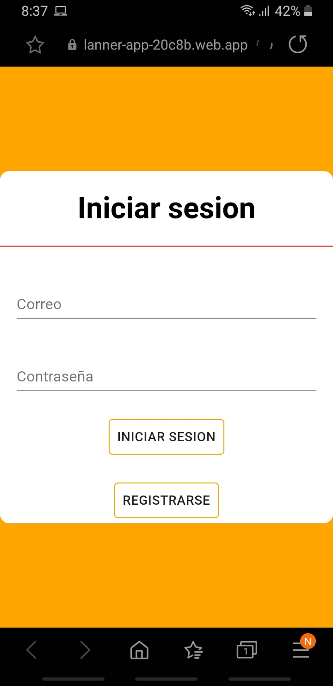
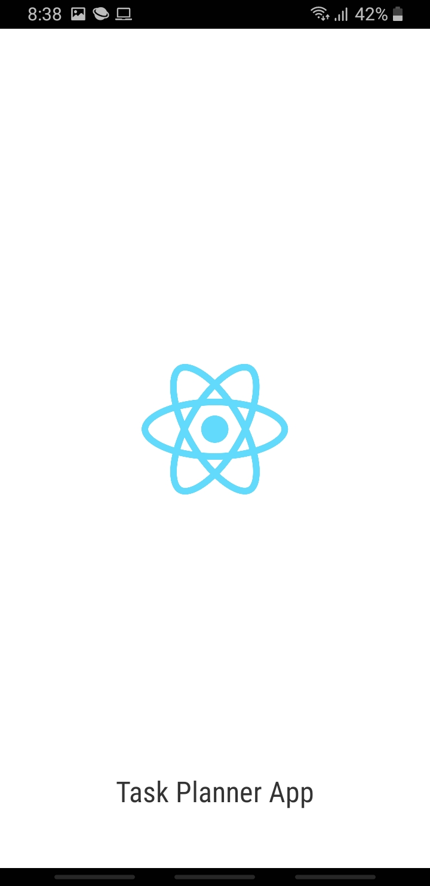
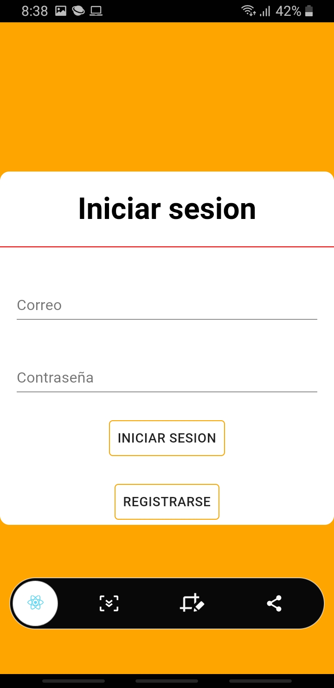

### Laboratorio 5 ieti

Presentado por: Jeisson Geovanny Sanchez Ramos

### App en android

Despues de instalarla

Abriendo la app

### Firebase Deploy

[link 1](https://task-planner-app-20c8b.firebaseapp.com/)

[link 2](https://task-planner-app-20c8b.web.app/)

### Enlace al enunciado del laboratorio

[ver](https://github.com/ieti-eci/1.5-task-planner-pwa)

### Enlace al lab anterior

[ver](https://github.com/JaySanchez0/IETI-LAB-04)

### Parte 1 generar iconos

El sitio web no lo permitio

### Datos 

Usuario: jay@mail.com

Password: test

